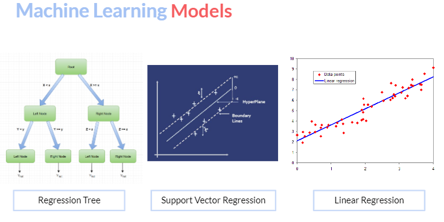

# COVID Hesitancy Machine Learning Project: Student-Assessment

## Self-Assessment
### Machine Learning
Over the course of The GW University Data Analytics Boot Camp Project, I was able to use my skills in machine learning to contribute regression model code, perform model evaluation and correlation analyses, and organize evaluation results in pandas dataframe tables.

### Supporting Roles
Early in the project, I was able to support teammates assigned the role of database management in brainstorming solutions to connect our eighth and final dataset to the rest of our database when it lacked a common column on which to join.  Using data from two columns of the eightf dataset, I conducted Application Programming Interface (API) call requests to create the missing common column.

Additionally, in support of my teammate assigned to data visualizations, I was able to provide timely peer review of charts used, give feedback on how the data could be interpreted, and troubleshoot Tableau challenges that arose.

My greatest personal challenge over the course of this project was coming to realize just how much information I had absorbed over the last 24 weeks.  At first, the thought of having to work together and present our project's findings before an audience of my peers seemed to me a daunting task, but by doing the work to bring my best to the group showed me how strong a grasp of the concepts studied I had gained.  This enabled me to present from a place of legitimacy and professionalism.

## Team Assessment
To communicate, my team leaned heavily on Slack and Zoom. I ended up putting Slack on my phone and would reccommend this tip to new cohorts kicking off the project.

As several of us had full time jobs and lived in different time zones, it was sometimes challenging finding time for a Zoom meet up that worked well with all of our schedules. However, we kept the project moving forward by meeting with whoever was available to achieve whatever meaningful progress we could each week.  

## Summary of Project
As the final project for The GW University Data Analytics Boot Camp, I worked in a team of five students to build, execute, and evaluate three machine learning regression models, each designed to predict COVID-19 vaccination hesitancy levels across the United States.

After cleaning and pre-processing the data to obtain 27 encoded features, we used linear regression, support vector regression, and regression tree models to predict three separate targets: what proportion of each U.S. county was deemed hesitanct, hesitant or unsure, and strongly hesitant to COVID vaccination.

The results of the analysis showed hesitancy levels could be predicted with a high degree of certainty based on a combination of factors, to include:

* vaccine availability,
* the prevalence of local health conditions,
* community risk and vaccination measures, 
* and local safety protocols such as mask mandates, gathering bans, and stay at home orders.
